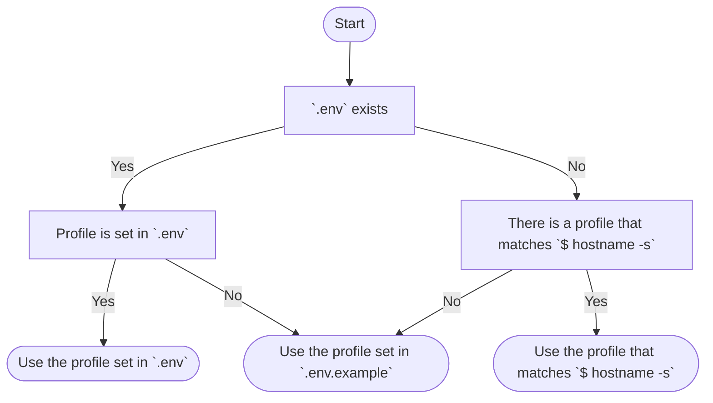

# dotfiles

This repository contains shell configurations,
a list of tools and applications to be installed, and their settings.
It is designed to provide a reproducible environment when migrating machines
and to maintain a history of the machine's configuration.

> [!Important]
> By default it contains my configuration for
> [git](config/home/.config/git/config),
> [ssh](config/home/.ssh/[mac]config), etc.
> If you want to use this repository, rewrite them accordingly.

## Design principles

- **Simple**  
    This keeps the code base of the script small and provides an effective management with a simple functionality.
    This also helps to reduce maintenance costs.
- **Portable**  
    The configuration is portable and can be used on any machine.
    In particular, the focus is on ease of use inside a Docker container.
- **Small**  
    To minimize dependencies, only carefully selected packages are used.

## Requirements

Intended for installation on Mac or Linux.

- bash
- git
- zsh(Optional)  
Required to use [configured zsh plugins](config/home/.config/sheldon/plugins.toml)
- curl(Optional)  
Required to perform a [Quick install](#quick-installation) or to install [Homebrew ↗](https://brew.sh/) on a Mac.
- GNU make(Optional)  
Required to run the [`make` commands](#usage) described below.

## Installation

Follow the [Quick install](#quick-installation) or [Manual install](#manual-installation) instructions.

> [!Warning]
> During installation, files in the `config` directory will overwrite files in your home directory.
> Please keep files in a safe place if you do not want them to be overwritten.

> [!Tip]
> [Manual installation](#manual-installation) is recommended if you want to customize and manage using git.

### Quick installation

```shell
curl -sL sh.s3igo.me | bash
```

### Manual installation

```shell
# after forking this repository
# 1. download
$ git clone https://github.com/<username>/dotfiles.git ~/.dotfiles

# 2. install
$ cd ~/.dotfiles
$ make install
```

## Usage

### Major commands

```shell
# run `make init` and `make link`
$ make install

# run `make cli` and `make gui`
$ make tools

# run `make update` and `make dump`
$ make sync

```
### Minor commands

```shell
# run `scripts/init.sh`
$ make init

# run `scripts/link.sh`
# re-create symbolic links
$ make link

# install CLI tools based on `package` directory
$ make cli

# install apps with GUI based on `package` directory
$ make gui

# update every package/plugin manager and its packages / plugins
$ make update

# reflects the current state of packages and plugins in the `package` directory
$ make dump

```

## Features

### Profile

Multiple profiles are supported.
This feature is currently only supported on Macs and allows for environment differences
from machine to machine by creating a directory with the same name as the profile in `packages/mac`.

The profile can be modified by placing an `.env` file in the project root,
and its behavior follows the flowchart below.




### Link

`make link` creates symbolic links according to the directory structure under `config/home`.
Files with a `[mac]` prefix in their filename only expand on macOS.
Similarly, files with a `[linux]` prefix only expand on Linux.

## License

[MIT](LICENSE)
