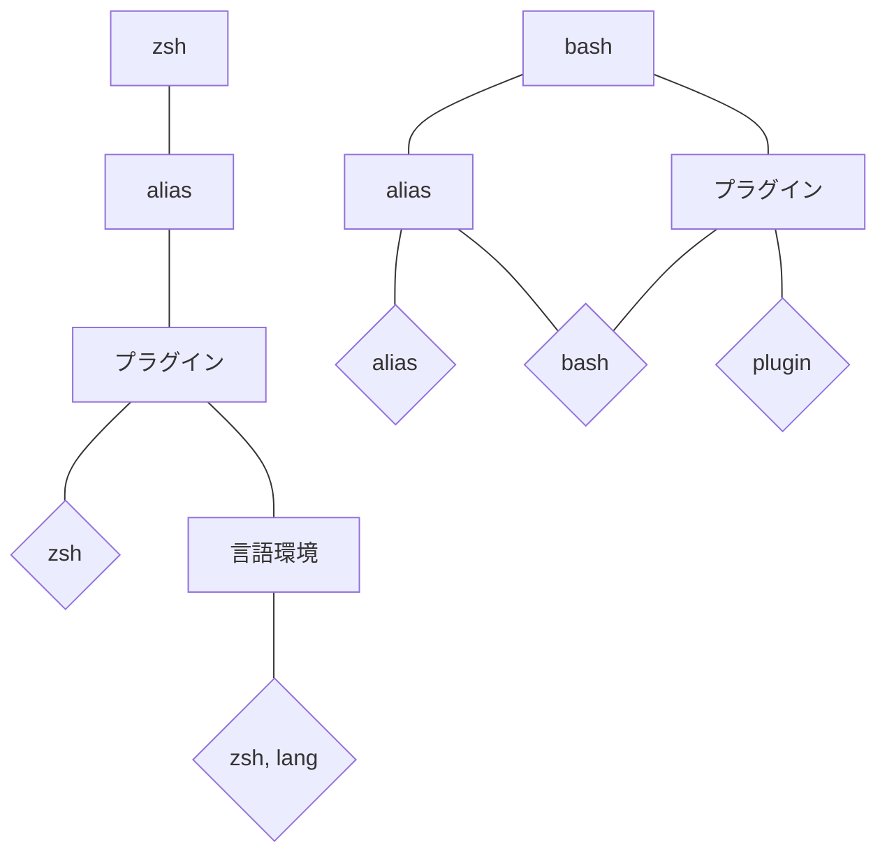

# dotfiles

## メモ
インストールするもの

```mermaid
graph
a[zsh]
b[bash]
a---aa[alias]
    aa---aaa[プラグイン]
        aaa---aaaa{zsh}
        aaa---aaab[言語環境]
            aaab---aaaba{zsh, lang}

b---ba[alias]
    ba---baa{alias}
b---bb[プラグイン]
    bb---bbb{bash}
    bb---bba{plugin}
    ba---bbb
```
※zshでaliasのみ設定する場合とbashでローカル言語環境(anyenv)を設定する場合は使う機会なさそうなので省いた